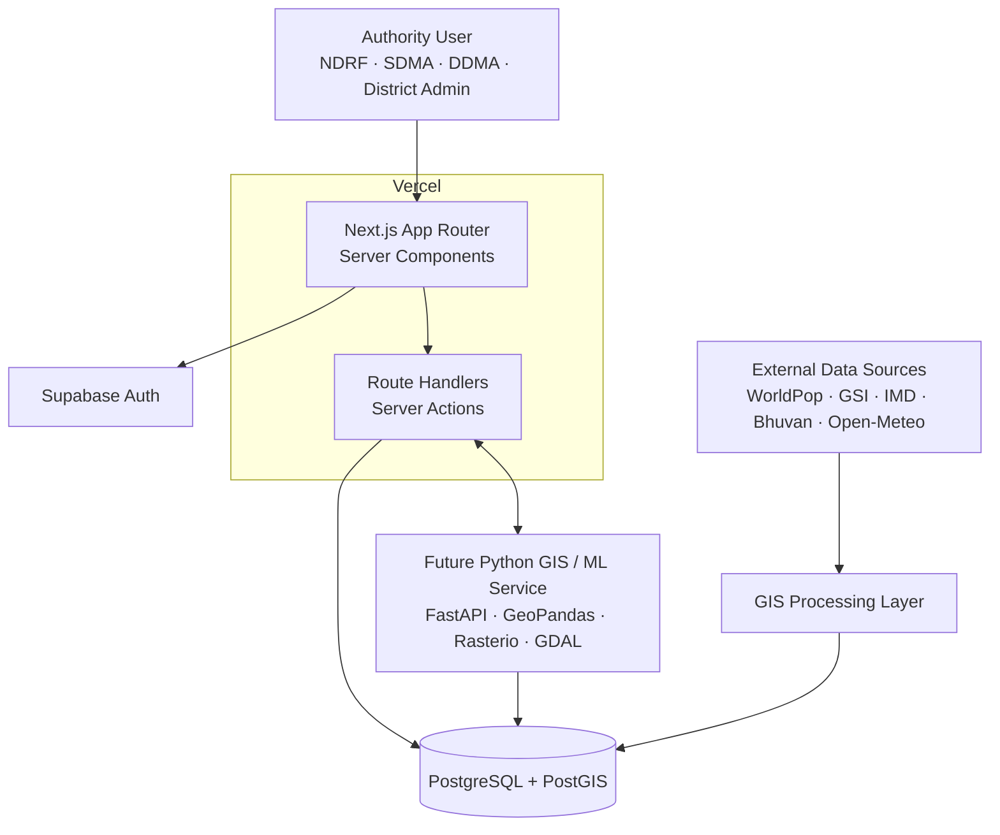

# RAKSHA — Architecture

**Problem Statement:** SIH26191 · Smart India Hackathon 2026

This document describes the Phase 0 architecture: the boundaries that exist
now, and the ones the later phases are expected to grow into.

---

## 1. Repository shape

RAKSHA lives in a single pnpm workspace. Phase 0 added `apps/web` (the Next.js
application) alongside the pre-existing Replit-generated packages, which were
left intact.

```
Disaster-Platform-Development/
├── apps/
│   └── web/                     Next.js App Router application  ← Phase 0 target
├── artifacts/
│   ├── blank-react-vite-app/    Existing Vite SPA prototype (preserved)
│   ├── api-server/              Existing Express 5 API (preserved)
│   └── mockup-sandbox/          Existing mockup sandbox (preserved)
├── lib/
│   ├── db/                      Drizzle schema package (preserved, legacy)
│   ├── api-spec/ api-zod/ api-client-react/   Orval codegen chain (preserved)
├── docs/                        This documentation set
├── supabase/                    Migrations and seed data (Phase 2 onward)
└── scripts/
```

### Why a second app instead of a rewrite

The existing Vite prototype contains substantial design work — a landing page,
a commander login and a commander dashboard with a Leaflet hazard map, layer
controls, a habitation panel and an analytics grid. It is written in plain
JavaScript against a different stack (Leaflet, react-router, hand-written CSS).

Rewriting it in place would have meant deleting working UI before its
replacement existed. Instead `apps/web` starts clean on the target stack, and
the prototype's screens are ported into it incrementally from Phase 1 onward.
Both build from the same repository in the meantime.

---

## 2. System architecture



---

## 3. Layer boundaries

The rule is that each layer may call downward but never upward, and no layer
may skip the one below it.

| Layer | Location | Responsibility | Must not |
|---|---|---|---|
| Presentation | `src/app`, `src/components` | Rendering, layout, accessibility, map and chart presentation | Contain SQL, or read secrets |
| Feature | `src/features/*` | Domain-specific composition per capability | Contain cross-feature logic |
| Server | `src/server/*` | Repositories, services, queries, server actions | Be imported by client components |
| Infrastructure | `src/lib/*` | Supabase clients, GIS utilities, config, validation | Contain business rules |
| Types | `src/types/*` | Shared vocabulary | Contain runtime logic |

### Server / client split

Server Components are the default. `"use client"` is added only for genuine
interactivity — the MapLibre canvas, Recharts charts, form state, event
handlers.

The boundary is enforced mechanically rather than by convention: every
server-only module imports the `server-only` package, which turns an
accidental client import into a **build error** instead of a leaked secret.
This guards `src/lib/config/server-env.ts`, `src/lib/supabase/server.ts` and
`src/lib/supabase/admin.ts`.

---

## 4. Data platform

**Supabase** provides Auth and a managed **PostgreSQL** instance with the
**PostGIS** extension. Three client factories keep the trust levels separate:

| Client | File | Key | Trust |
|---|---|---|---|
| Browser | `lib/supabase/client.ts` | anon | Constrained by RLS |
| Server | `lib/supabase/server.ts` | anon, acting as the signed-in user | Constrained by RLS |
| Admin | `lib/supabase/admin.ts` | service role | **Bypasses RLS** — ingestion jobs only |

Authorisation is enforced in the database through Row Level Security. Role
checks in the frontend affect presentation only and are never the security
boundary.

All three factories return `null` when Supabase is unconfigured. This is
deliberate: Phase 0 must build and deploy with no credentials at all, so a
missing integration produces an honest "not configured" state rather than a
build failure.

---

## 5. GIS architecture

MapLibre GL JS is the **renderer**, not the source of truth. Geometry lives in
PostGIS; MapLibre draws what the server hands it.

```
src/components/gis/   Map canvas, controls, legends        (client)
src/lib/gis/          CRS maths, layer definitions          (isomorphic)
src/server/repositories/  PostGIS queries                   (server only)
```

### Coordinate reference systems

| Purpose | CRS | Notes |
|---|---|---|
| Storage and interchange | EPSG:4326 | Degrees. GeoJSON axis order `[lng, lat]` |
| Web map tiles | EPSG:3857 | Rendering only — its metres are latitude-distorted |
| Metric analysis | UTM zone (EPSG:326xx) | Selected per region; see `selectMetricCrs()` |

Distances and areas are **never** computed from raw EPSG:4326 degrees. A degree
of longitude is ~111 km at the equator and collapses toward the poles, so
Euclidean maths on lat/lng is wrong by a latitude-dependent factor.
`src/lib/gis/crs.ts` provides spherical distance for coarse UI ordering only;
anything that feeds a published figure is computed in PostGIS against a
projected CRS.

### Basemaps

The basemap is configuration, not a hardcoded dependency
(`NEXT_PUBLIC_MAP_STYLE_URL`). This keeps the option open to switch to GSI,
ISRO Bhuvan or another authorised provider. Provider keys are never committed,
and tile endpoints are never scraped or guessed.

---

## 6. Validation

Zod is the single validation mechanism, applied at every trust boundary:
inbound request bodies and query parameters, external API responses, and
environment configuration. Parsed data crosses into the application as a typed
value; `unknown` plus an explicit narrowing step is used instead of `any`.

---

## 7. Future Python GIS / ML service

A separate service at `services/geospatial-engine/` is **not** part of Phase 0
and should be introduced only when a workload genuinely cannot run inside a
Vercel function:

- raster processing (GeoTIFF, DEM) via Rasterio/GDAL
- long-running geoprocessing beyond the function execution limit
- ML inference requiring scientific Python
- bulk ingestion pipelines with GeoPandas

Until then, the boundary is kept clean by routing all data access through
`src/server/repositories/`, so relocating a computation later changes one layer
rather than the whole application.

---

## 8. Observability roadmap

Not implemented in Phase 0, and deliberately not solved with a paid service
before there is something to observe.

- Structured request logs (the preserved `api-server` already uses pino)
- Error tracking keyed by the Next.js `error.digest` correlation id
- `processing_runs` table recording every ingestion and derivation
- Ingestion failure surfacing in the admin UI
- Vercel deployment and function logs as the first-line signal
